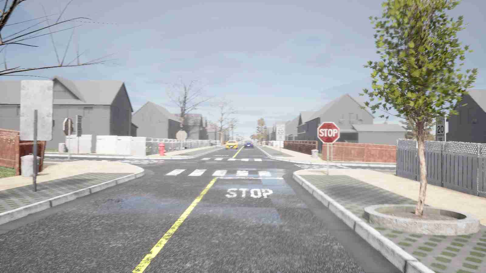
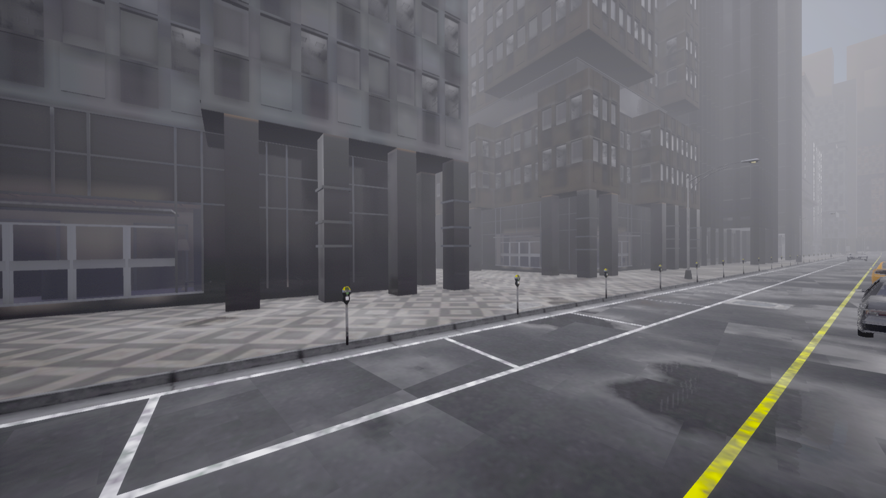
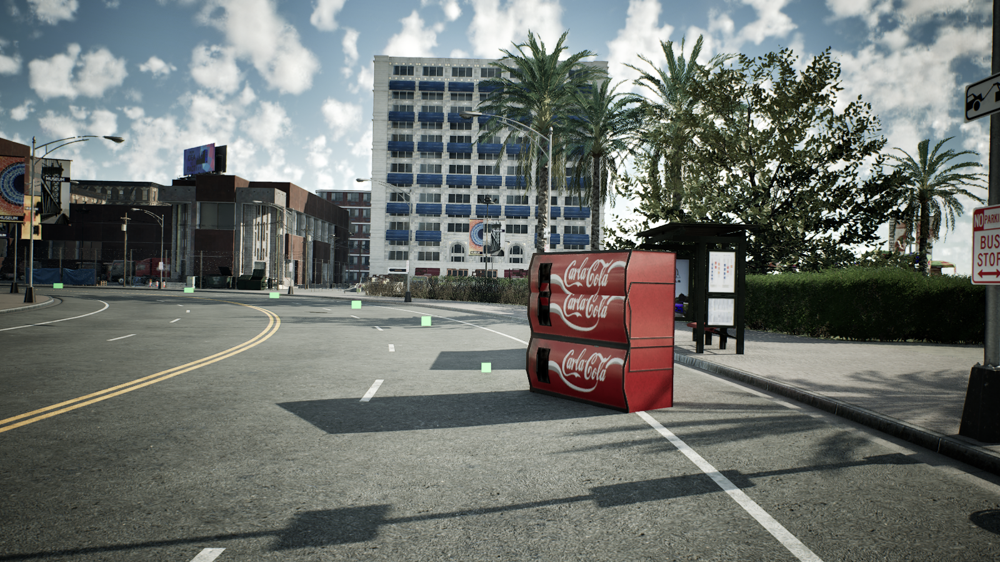

# HiDrive

<p align="center">
  <strong>A Closed-Loop Benchmark for High-Level Autonomous Driving</strong>
</p>

<p align="center">
  HiDrive focuses on <strong>long-tail scenarios</strong> and <strong>high-level driving capabilities</strong> such as legal compliance, ethical reasoning, and emergency response.
</p>

<p align="center">
  <a href="https://huggingface.co/HiDriveBenchmark/HiDriveBenchmark">Hugging Face Assets</a>
</p>

---

## Overview

Recent autonomous-driving benchmarks are becoming saturated, but saturation does not mean the real problem is solved.
HiDrive is designed to stress-test models in rare, safety-critical, and norm-sensitive situations that are underrepresented in existing benchmarks.

HiDrive provides:

- 330 closed-loop routes (about 150m each)
- 30 high-level ability categories
- 94 concrete scenario instantiations
- CARLA UE5-based simulation with higher-fidelity rendering and lighting

---

## Visual Comparison

The benchmark is built with newer rendering and richer assets for stronger realism.

| HiDrive | HiDrive | Bench2Drive | Bench2Drive |
|---|---|---|---|
|  |  |  |  |
|  |  |  |  |

---

## Representative Long-Tail Scenarios

| Case 1 | Case 2 | Case 3 |
|---|---|---|
|  |  |  |
| Cyclist suddenly emerges from occlusion | Parked vehicle opens its door unexpectedly | Broken-down vehicle with warning setup |

| Case 4 | Case 5 | Case 6 |
|---|---|---|
|  |  |  |
| Puddle-side pedestrians requiring ethical slowing | Police-stop compliance | Diverse uncommon road obstacles |

---

## Ability Taxonomy

HiDrive evaluates 30 abilities in three levels:

- Basic Set (11): core operational capabilities (e.g., detouring, merging, overtaking)
- Hard Set (10): rule- and norm-aware capabilities (e.g., emergency yielding, pedestrian ethics)
- Thorny Set (9): dilemma-level decisions (e.g., red-light emergency yielding, wrong-way avoidance)

This design supports fine-grained diagnosis beyond route-level averages.

---

## Evaluation Metrics

For each route, HiDrive reports:

- `DS` (Drive Score)
- `RC` (Route Completion)
- `LS` (Legal Score)
- `ES` (Ethics Score)

Core formulation:

```text
DS = RC * LS * ES
```

Compared with collision-only evaluation, HiDrive adds legal and ethical dimensions and includes scenario-aware penalty logic.

---

## Main Findings

On 330 evaluation routes, existing methods still struggle in long-tail and high-level reasoning scenarios:

| Method | Overall DS | RC | LS | ES |
|---|---:|---:|---:|---:|
| DiffusionDrive | 34.2 | 58.3 | 49.1 | 91.4 |
| ORION | 37.4 | 65.3 | 54.8 | 93.5 |
| SimLingo | 42.3 | 70.5 | 63.3 | 94.8 |
| KnowVal | **46.6** | **73.8** | **69.3** | **97.4** |

These results suggest that long-tail robustness and legal-ethical reasoning remain open challenges for current autonomous-driving systems.

---

## Repository Structure

```text
.
├── docs/                       # Documentation and README image assets
├── leaderboard/                # Evaluation pipeline and route data
├── scenario_runner/            # Scenario implementations
├── scripts/                    # Evaluation scripts
└── tools/                      # Utilities
```

## Benchmark Docs

- Installation and setup: `docs/HiLevAD/INSTALL.md`
- Metric definitions: `docs/HiLevAD/METRICS.md`
- Route split protocol: `docs/HiLevAD/SPLITS.md`

---

## Citation

```bibtex
@article{xia2026hidrive,
  title={HiDrive: A Closed-Loop Benchmark for High-Level Autonomous Driving},
  author={Xia, Zhongyu and Zhu, Guanyu and Tang, Guo and Chen, Wenhao and Wang, Yongtao and Yang, Ming-Hsuan},
  journal={arXiv preprint arXiv:xxxx.xxxxx},
  year={2026}
}
```

If you use HiDrive in your research, please cite the paper.
